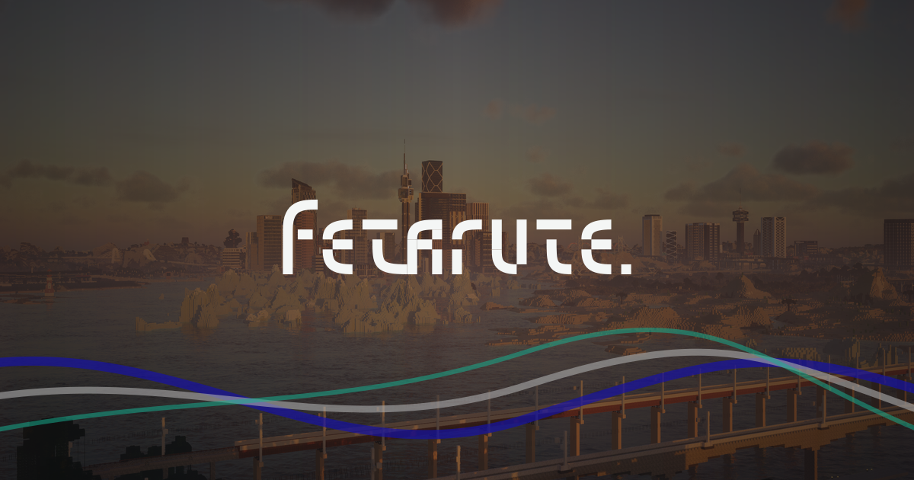

# Fetarute

Fetarute 是一个自 2017 年起持续建设的 Minecraft 社区。它从一座 Forge 模组铁路服务器起步；后来，承载世界的方式从模组转向原版与插件，铁路仍然留在每一次相遇、建设与出发之间。

今天的 Fetarute 由三个彼此相连的世界组成。服连快线（Serverlink）穿行其间，让它们保有不同的生活方式，也始终能够彼此抵达。

## 三个世界，一段旅程

- **创造服**延续 Fetarute 的轨交城建传统。人们在这里规划街区、铺设线路，把交通设施、城市与建筑群从设想变成可以抵达的地方。
- **大厅服**是创造服与生存服之间的中转枢纽。高楼与空岛保存着过去的痕迹，也让每一次到达都有重新选择方向的机会。
- **生存服**让铁路随着共同生活自然延伸。资源、聚落与远方被线路连接，每一次探索和建设都会在世界里留下新的路径。

铁路没有让三个世界变得相同，而是让它们能够彼此抵达。Fetarute 也不只由建筑与风景组成：讨论一条线路、一起完成一次试车、维护熟悉的街区，都是这个世界继续生长的方式。

## 从这里出发

- [Fetarute 官网](https://fetarute.org)
- [Fetarute Wiki](https://wiki.fetarute.org)
- [生存服地图](https://map.survival.fetarute.org)
- [大厅服地图](https://map.lobby.fetarute.org)
- [创造服地图](https://map.creative.fetarute.org)

第一次来到 Fetarute，可以加入
**QQ 门户群：517248890**，告诉我们你想看的世界、想走的线路，或想认识的人。

如果你正在维护 Fetarute 官网，请阅读[网站开发与发布指南](docs/development.md)。
